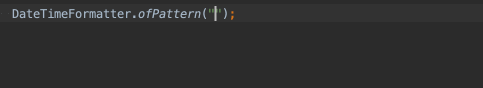

# jsr310-intellij-plugin

Plugin that adds supports for JSR-310 (Java Date and Time API).

You can get it from [Marketplace](https://plugins.jetbrains.com/plugin/15832-jsr-310-support) or IDE's plugin manager.

## Features

- Validate `DateTimeFormatter.ofPattern`
  * 
- Parse texts on-the-fly
  * 

## Installation Notes

- If you use earlier version of Intellij IDEA 2020.x, restarting IDE might be necessary to enable `DateTimeFormatter.ofPattern` validation which is implemented as `language injection`
  * Refs [IDEA-226265](https://youtrack.jetbrains.com/issue/IDEA-226265)
